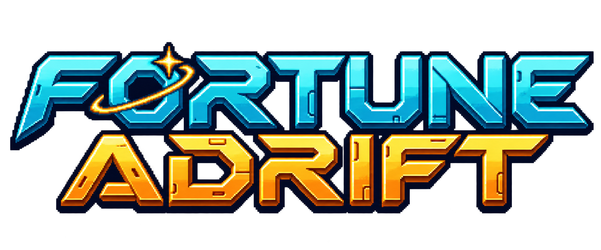
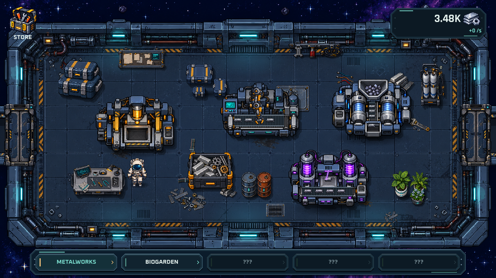
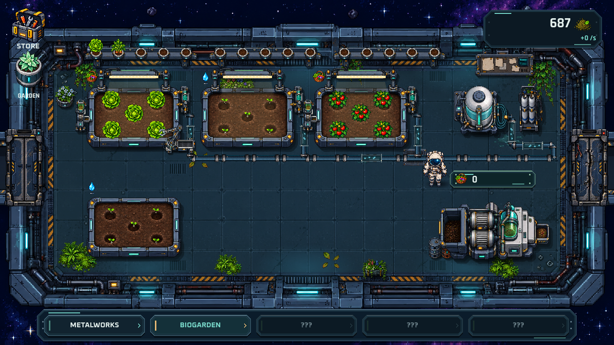

# Fortune Adrift

**A space-themed incremental game by Hanzolek.**

Rebuild a damaged spaceship through production, exploration and automation. Start with a manual metal press and work toward restoring the ship's systems.

> This repository is a portfolio showcase. It contains descriptions and screenshots only. It does not provide game downloads, source code or builds.

## Gameplay

- Five production rooms with their own currencies and activities.
- Metalworking, cultivation, fuel synthesis, crystal systems and navigation.
- Branching upgrade trees and manual-to-automatic progression.
- Machine faults, repairs, collections and hidden bonuses.
- Achievements, statistics, saves and ten language options.

## Screenshots

## Development

Built with **Godot 4 / GDScript**. Current portfolio materials show the game during development and testing.

My role covers concept, mechanics, progression, economy, interface direction and iterative playtesting. The project is developed with assistance from AI tools for code and materials.

## Po polsku

Fortune Adrift to kosmiczna gra incremental o naprawianiu statku. Gracz rozwija produkcję, automatyzuje pomieszczenia i przywraca sprawność pokładowych systemów.

To prezentacja portfolio — bez udostępniania gry ani kodu.

**Author:** [Hanzolek / Hanzikkk](https://github.com/Hanzikkk)
